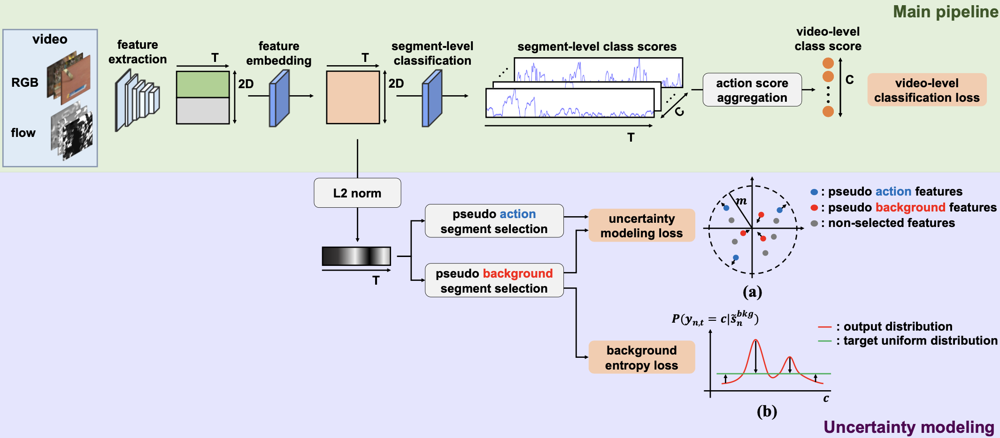

# AGCT

A PyTorch implementation of AGCT based on the paper
[Attention Guided Collaborative Training for Weakly-supervised Temporal Action Localization]().



## Usage

Git clone the corresponding repos and replace the files provided by us, then run the code according to `readme` of 
corresponding repos.

For example, to train HAM-Net on THUMOS14 dataset:
```
git clone https://github.com/asrafulashiq/hamnet.git
mv AGCT/hamnet/* hamnet/*
python main.py
```

To evaluate HAM-Net on THUMOS14 dataset:
```
python main.py --test --ckpt [checkpoint_path]
```

## Benchmarks

The models are trained on one NVIDIA GeForce TITAN X GPU (12G). All the hyper-parameters are the default values.

### THUMOS14

<table>
<thead>
  <tr>
    <th rowspan="3">Method</th>
    <th colspan="8">THUMOS14</th>
    <th rowspan="3">Download</th>
  </tr>
  <tr>
    <td align="center">mAP@0.1</td>
    <td align="center">mAP@0.2</td>
    <td align="center">mAP@0.3</td>
    <td align="center">mAP@0.4</td>
    <td align="center">mAP@0.5</td>
    <td align="center">mAP@0.6</td>
    <td align="center">mAP@0.7</td>
    <td align="center">mAP@AVG</td>
  </tr>
</thead>
<tbody>
  <tr>
    <td align="center"><a href="https://github.com/asrafulashiq/hamnet">HAM-Net</a></td>
    <td align="center">65.9</td>
    <td align="center">59.4</td>
    <td align="center">51.0</td>
    <td align="center">41.2</td>
    <td align="center">31.1</td>
    <td align="center">20.4</td>
    <td align="center">10.9</td>
    <td align="center">40.0</td>
    <td align="center"><a href="https://pan.baidu.com/s/1mv-RHb9VNu2FYBdzjNehPA">MEGA</a></td>
  </tr>
  <tr>
    <td align="center"><a href="https://github.com/zhang-can/CoLA">CoLA</a></td>
    <td align="center">66.5</td>
    <td align="center">60.3</td>
    <td align="center">52.1</td>
    <td align="center">42.8</td>
    <td align="center">33.8</td>
    <td align="center">23.7</td>
    <td align="center">12.7</td>
    <td align="center">41.7</td>
    <td align="center"><a href="https://pan.baidu.com/s/1mv-RHb9VNu2FYBdzjNehPA">MEGA</a></td>
  </tr>
  <tr>
    <td align="center"><a href="https://github.com/harlanhong/MM2021-CO2-Net">CO<sub>2</sub>-Net</a></td>
    <td align="center">69.1</td>
    <td align="center">63.4</td>
    <td align="center">53.8</td>
    <td align="center">45.0</td>
    <td align="center">37.1</td>
    <td align="center">24.6</td>
    <td align="center">12.7</td>
    <td align="center">43.7</td>
    <td align="center"><a href="https://pan.baidu.com/s/1mv-RHb9VNu2FYBdzjNehPA">MEGA</a></td>
  </tr>
</tbody>
</table>

mAP@AVG is the average mAP under the thresholds 0.1:0.1:0.7.

### ActivityNet

<table>
<thead>
  <tr>
    <th rowspan="3">Method</th>
    <th colspan="4">ActivityNet 1.2</th>
    <th rowspan="3">Download</th>
  </tr>
  <tr>
    <td align="center">mAP@0.5</td>
    <td align="center">mAP@0.75</td>
    <td align="center">mAP@0.95</td>
    <td align="center">mAP@AVG</td>
  </tr>
</thead>
<tbody>
  <tr>
    <td align="center"><a href="https://github.com/asrafulashiq/hamnet">HAM-Net</a></td>
    <td align="center">41.1</td>
    <td align="center">24.6</td>
    <td align="center">5.0</td>
    <td align="center">24.5</td>
    <td align="center"><a href="https://pan.baidu.com/s/11_7eu29IQ50rBU2W-dFceg">MEGA</a></td>
  </tr>
  <tr>
    <td align="center"><a href="https://github.com/zhang-can/CoLA">CoLA</a></td>
    <td align="center">40.5</td>
    <td align="center">26.7</td>
    <td align="center">2.9</td>
    <td align="center">25.8</td>
    <td align="center"><a href="https://pan.baidu.com/s/11_7eu29IQ50rBU2W-dFceg">MEGA</a></td>
  </tr>
  <tr>
    <td align="center"><a href="https://github.com/harlanhong/MM2021-CO2-Net">CO<sub>2</sub>-Net</a></td>
    <td align="center">43.1</td>
    <td align="center">26.0</td>
    <td align="center">5.3</td>
    <td align="center">26.2</td>
    <td align="center"><a href="https://pan.baidu.com/s/11_7eu29IQ50rBU2W-dFceg">MEGA</a></td>
  </tr>
</tbody>
</table>

mAP@AVG is the average mAP under the thresholds 0.5:0.05:0.95.
